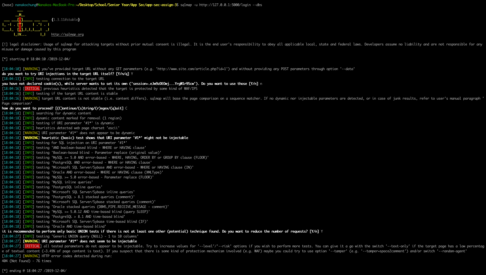
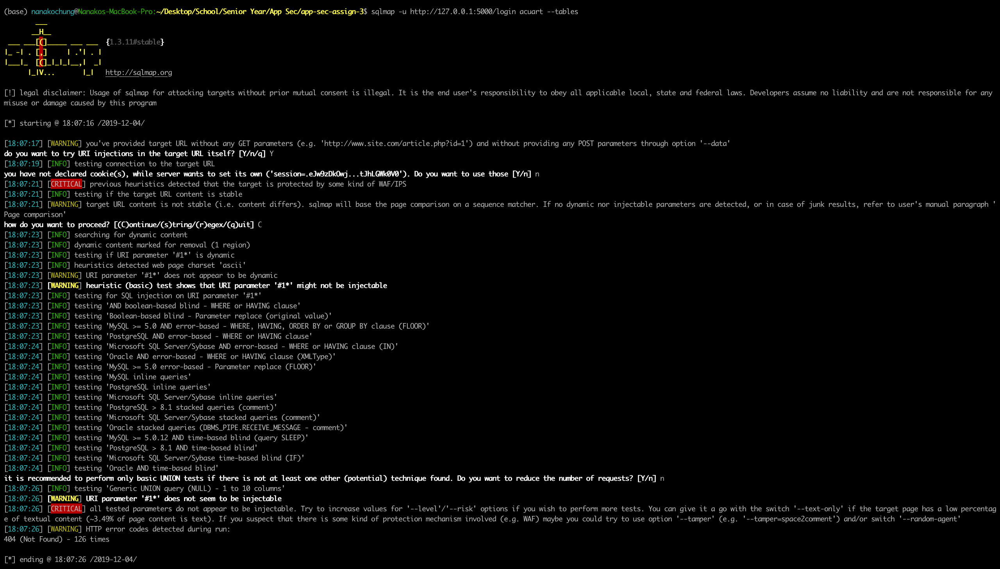
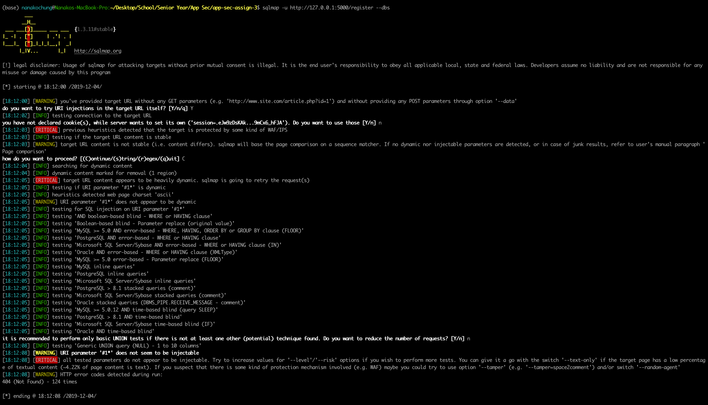
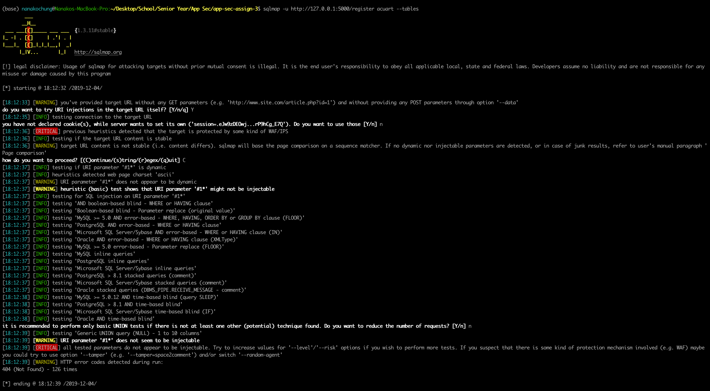
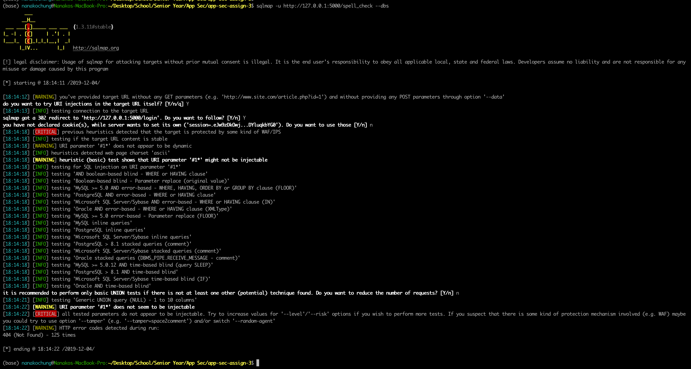
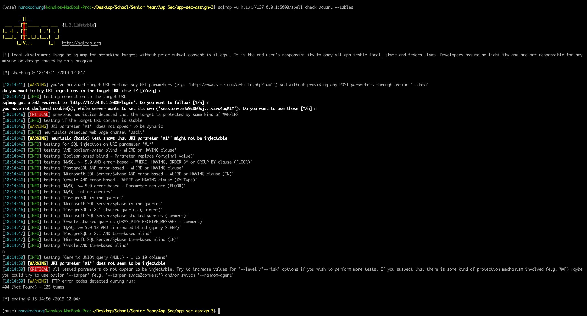

# Assign 3 

### Introduction

Git link: https://github.com/nanako-chung/app-sec-assign-3

This assignment focuses on secure database creation and management. For this assignment,
you are tasked with building a database back-end to the Web service you created in
Assignment 2, as well as adding some features to the Web service that the database enables.
The emphasis of this assignment is on the security of the Database. After developing the
database and the new features, you are tasked with testing it to ensure that it is not vulnerable
to common attacks, such as SQLi, and that permissions are correctly set. You should continue
to use the secure development practices that have been esatblished in this course.

### Setup
Completion time – less than 1 hour.

In addition to all of the technologies that were needed for the Web application made in the
previous assignment, you will need a database technology. In this assignment you will be using
SQLite. This can be installed on ubuntu using the following command:
```
$ sudo apt-get install sqlite3
```

In addition, you may want to consider using an ORM such as SQLAlchemy. This will make the
assignment a lot simpler. To install SQLAlchemy, you can use pip.
```
$ sudo pip3 install sqlalchemy
```

For part two of this assignment you will need SQLMap. SQLMap can be installed from the instructions at http://sqlmap.org/.

### Deliverables & Grading
The source code is to be submitted through Gradescope. Your submission should be a
compressed archive file, or Github integration. The report should be submitted to NYU Classes.
The point values for this assignment are as follows:
1. Database code - 40 pts.
2. Tests – 10 pts.
3. Reports – 50 pts.
 Total 100 pts.
 
### Week 9
Completion time – 3 to 10 hours, depending on experience.

In part one of this assignment, you are tasked with modifying your Web service from Assignment 2 to store the following things in a database backend:
1. User information (username, password, 2fa info, etc.)
2. Submitted text for spell checking
3. The results of spell checking
4. Logs of logins and logouts.

In addition to the creation of a database for these records, you must implement new functionality
described below.

#### Modifications
Simply, the user information that you were storing in memory for the last assignment must be
translated over to a database. This means that the user login and registration pages from
Assignment 2 must now work with SQLIte, as should the text submission and result retrieval
pages. For a refresher on security requirements for password storage, see the last subsection
of Part 1.

#### Record history
A registered user should be allowed to view all of the queries that they have submitted in the
past, available at /your/webroot/history. The page should report the total number of queirues
made in an element with id=numqueries. Each query should be presented in an element with
id=query# where # is a unique identifier for that query. The user can click on any given query
and enter a query review page, described in the next subsection.

Users should only have access to their own queries, with one exception. If a user is an admin,
they should be able to review the queries of any user. The admin should be able to enter a
username into a form with id=userquery, and upon submission should be able to get the history
of that user as described above.

The expected account details for the default admin account are:
username: admin
password: Administrator@1
2fa: 12345678901

#### Query Review
If a user has access to a given query, they should be able to review it at the page /your/webroot/
history/query# where # is the unique identifier of that query. When this page is visited, the
following information should be given:
1. The query id in an element with id=queryid
2. The username of the account that submitted the query in an element with id=username
3. The query text in an element with id=querytext
4. The query results in an element with id=queryresults

If a user does not have access to a given query, the user should not be shown any of this
information.

#### Logs of logins and logouts
From time to time, usually to investigate suspicious activity, an admin may need to see when a
given user logged in, when they logged out, etc. For this reason, admins should be able to
access the login history of a given user at the location /your/webroot/login_history. This page
should contain a form with id=userid that an admin can fill in to get the login history of a given
user. When submitted, the history should be returned in a list, with each list element having
id=login# and containing the following information elements:
1. the login time in an element with id=login#_time
2. the logout time in an element with id=logout#_time
In these elements, # refers to the unique number for the login/logout event.
If the user is still logged in and there is no logout time, simply mark the logout time as “N/A.”

In practice logging of this nature would contain more information, such as the IP address of the
user, etc. However, for simplicity we do not require you to log this information.

#### Security Requirements
Each of these functionalities must be provided securely. Passwords should be stored in a nonreversable way that seeks to make rainbow table attacks infeasable, and to slow attacks like brute force attacks. You should protect against SQL injection attacks, and access control must be strictly enforced.

#### Report
You are required to submit a report describing your design decisions for the database, including
the schmea of the database, etc. Your report should include what threats you considered when
you created the database and how you believe you avoided them.

### Week 10
Completion time – 3 to 5 hours, depending on experience.

After you design and create your database backend using SQLite, you must test to make sure
that your code is not vulnerable to SQLi attacks and that you are performing proper access
control. SQLi attacks can be checked using SQLMap, and by and by attempting some SQLi
attacks by hand. Information on downloading and using SQLMap can be found at
https://sqlmap.org/.

### Tests using SQLMap







